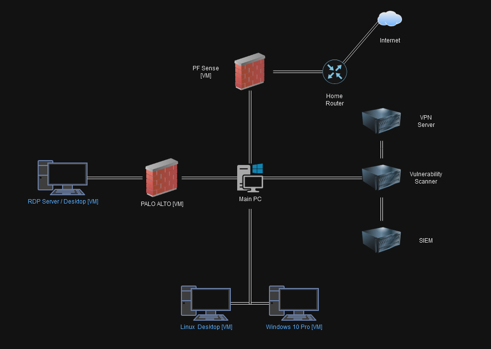

  <h2><b>Cyber Security Home Lab Project</b></h2>

## Objective
I will be creating a homelab environment meant to simulate the components of an I.T. infrastruce, equipment, and configurations similar to a business or enterprise network. 

My goal of this project is to understand the process of installing, configuring, and optimizing I.T. infrastrucuter at a relatively small scale so I can apply this process to a real-world business or enterprise network.

## Topology & Overview
In this homelab environment, my aim is to set up, manage, and simulate a variety of systems and services, such as Active Directory, Remote Desktop Protocol, vulnerability scanners, SIEM, VPN servers, and workstations.

